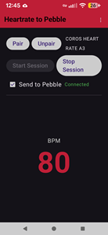
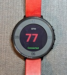

# Heartrate2Pebble 

A lightweight, open-source Android bridge that streams real-time heart rate data from Bluetooth LE wearables directly to your Pebble smartwatch.

## Overview
This app is designed for users who want to monitor their heart rate without constantly checking their phone. It functions as a foreground service that:
1. Connects to a Bluetooth Low Energy (BLE) Heart Rate Strap.
2. Displays live data on your Android device.
3. Forwards heart rate packets to your Pebble watch via the Pebble app.

|   Android Interface | Pebble Watchface |
| :---: | :---: |
   
|  |  |

| *Heartrate measurement.* | *BPM forwarded to Pebble watch.* |

## Features
- **Foreground Service:** Reliable data streaming even when the app is in the background or the screen is off.
- **Auto-Scan:** Once the wearable is paired, automatically looks for your heart rate strap on startup.
- **Disconnect Alerts:** Configurable watch alerts trigger when connection is interrupted.
- **Pebble Integration:** Optimized for low-latency updates to your wrist.
- **Battery Efficient:** Built to minimize radio wake-ups.

## Getting Started

### Prerequisites
- **Android Device:** (Android 12+ recommended).
- **Wearable:** Any standard BLE Heart Rate Monitor (Polar, Garmin, Wahoo, etc.).
- **Watch:** A Pebble Smartwatch connected via the Pebble App.

### Installation
1. Download the latest APK from the [Releases](link-to-your-github-releases) page.
2. Get the Pebble app from the Pebble store.
2. Grant **Bluetooth** and **Nearby Devices** permissions.
3. Grant **Notification** permissions (required for the background service).
4. Pair your Heart Rate strap within the app.
